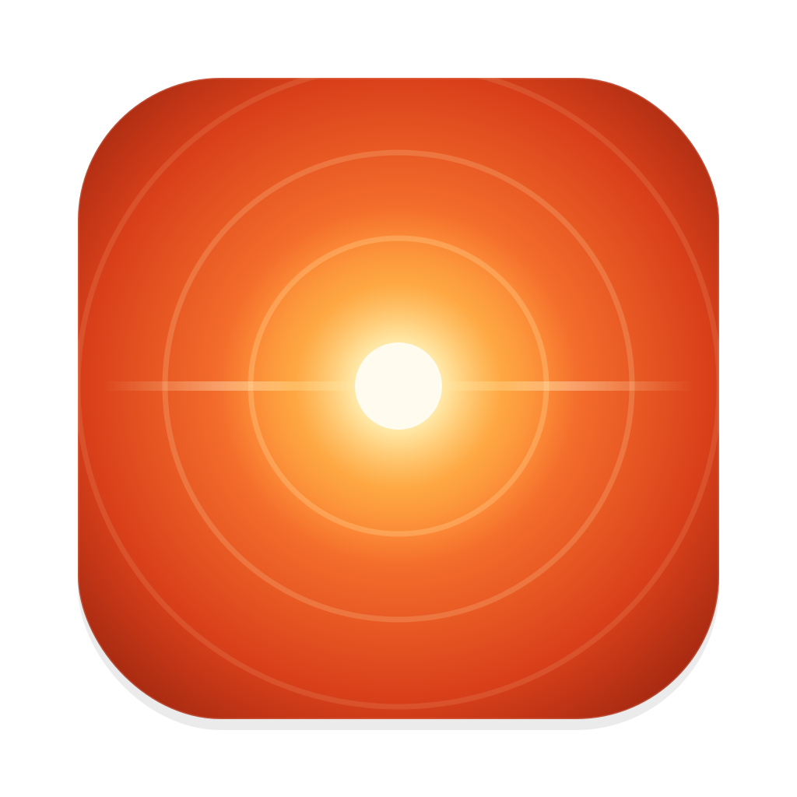

<div align="center">



# Flare

**Your agents are waiting. You'll know in under a second.**

A macOS menu bar app that flashes your whole screen the moment an AI agent needs you —
over full-screen apps, on every Space, on every display.


<a href="https://github.com/priyomukul/flare/releases/latest"></a>

</div>

---

## The problem

You run three or four coding agents at once. One hits a permission prompt. Another finishes
its turn and sits there. A third asks a question.

Banners stack up and slide away. Sounds blur into every other sound your Mac makes. You
notice ten minutes later that everything has been idle the whole time — and the thing you
were actually running agents in parallel *for* just cost you the afternoon.

## What Flare does

**It flashes the entire screen.** Red-orange, two soft pulses, about a second. Impossible to
miss, impossible to sleep through, and it lands on top of whatever you are doing — including
full-screen apps and other Spaces.

**It keeps nagging.** Anything left unanswered flashes again every couple of minutes. Walk
away for a while and it flashes the moment you sit back down, so you never return to a screen
full of agents that have been blocked since you left.

**It tells you who.** A badge in the corner of the flash, and a menu bar list you can clear
with one click:

```
api-server · 4m · Claude needs your permission to use Bash
web        · 1m · AskUserQuestion
```

**It works with anything.** Signals arrive over loopback HTTP, so any tool that can run
`curl` can set one off:

```sh
curl -s -m 1 -X POST http://127.0.0.1:4242/waiting -d '{"agent":"codex-api"}'
```

Claude Code gets first-class support — paste one hooks block and every session, including
ones running inside [Conductor](https://conductor.build), starts reporting for itself.

### Built small on purpose

- **One process, zero dependencies.** Swift and AppKit, nothing else. No Sparkle, no
  Electron, no framework, no accounts.
- **No Dock icon, no window.** A beacon in the menu bar, and a flash when it matters.
- **Nothing leaves your Mac.** The listener binds `127.0.0.1` only, never `0.0.0.0`. The one
  exception is an optional daily version check against GitHub, which one toggle turns off.
- **Photosensitivity is a hard limit, not a setting.** Flare will not start a flash within
  half a second of the last one, whatever arrives — two per second at absolute worst.
- **About 1,800 lines of Swift**, across ten files. You can read the whole thing in an
  afternoon.

---

## Install

**Homebrew** — one command, and `brew upgrade` keeps it current:

```sh
brew trust https://github.com/priyomukul/flare
brew tap priyomukul/flare https://github.com/priyomukul/flare
brew install --cask flare
open -a Flare
```

Homebrew 6 makes you trust a third-party tap before it will load a cask from it. That first
line is a one-off, and it has to come **first** — most Homebrew versions load and validate the
cask during `brew tap` itself, so tapping an untrusted tap fails outright with
`Cannot tap: invalid syntax in tap!`. It also has to be the full URL rather than
`priyomukul/flare`: a tap with a custom remote is identified by its URL.

**Or the drag-and-drop installer** — grab `Flare-<version>.dmg` from
[Releases](https://github.com/priyomukul/flare/releases), open it, and drag Flare into
Applications.

Flare is ad-hoc signed rather than notarised with a paid Developer ID, so Gatekeeper does
not recognise it. The cask strips the quarantine flag for you. If you install from the DMG
instead, macOS will refuse the first launch — right-click Flare in Applications, choose
**Open**, and confirm once. After that it opens normally.

Check it is listening:

```sh
curl -s -X POST http://127.0.0.1:4242/waiting -d '{"agent":"test"}'
```

Every screen should flash, and the beacon should show `1`.

Now point your agents at it — **[Claude Code setup](docs/claude-code.md)** takes one paste,
or see **[integrations](docs/integrations.md)** for everything else.

To uninstall: `brew uninstall --cask flare --zap`, and remove the hooks block.

---

## Documentation

| Document | What is in it |
| --- | --- |
| [Claude Code](docs/claude-code.md) | The hooks block, why each trigger is there, Conductor |
| [Integrations](docs/integrations.md) | Generic `curl`, terminal bell, shell helpers |
| [HTTP API](docs/http-api.md) | Every route, both payload shapes, status codes |
| [Configuration](docs/configuration.md) | The menu, settings, nagging behaviour, photosensitivity, updates |
| [Development](docs/development.md) | Build, make targets, project layout, testing, releasing |
| [Design notes](docs/design-notes.md) | Why things are built the way they are, and the traps |
| [Troubleshooting](docs/troubleshooting.md) | When it misbehaves, and how to uninstall |

---

## Contributing

Issues and pull requests are welcome. Flare is small enough that you can read all of it, and
[docs/design-notes.md](docs/design-notes.md) explains why each unobvious decision is the way
it is — worth a skim before changing something that looks wrong.

### Ground rules

These are what keep Flare small, and a PR that breaks one needs to argue for it:

1. **No third-party dependencies.** `Package.swift` has no `dependencies` array and should
   stay that way. AppKit, Network.framework and Foundation cover everything so far.
2. **No private APIs**, and macOS 14 is the floor.
3. **Nothing beyond `127.0.0.1`** except the update check, which is opt-out and does one
   thing.
4. **The photosensitivity limit is not negotiable.** Never more than three flashes per second
   by any path; Flare currently caps at two.
5. **Features earn their place.** No plugin system, no accounts, no database, no telemetry, no
   self-updating binary. If it needs a settings toggle to be tolerable, it probably should not
   ship.

### Getting set up

```sh
git clone https://github.com/priyomukul/flare.git
cd flare
make run
```

Full setup, make targets and project layout: [docs/development.md](docs/development.md).

### Before you open a PR

```sh
make run && make smoke     # 30 assertions across every route
```

`swift build -c release` must be warning-free. If you touched the overlay, the timers or the
menu, run the by-hand checks in
[docs/development.md § Testing](docs/development.md#testing) — full-screen coverage, display
sleep and monitor unplug, and Pause/Resume all need real hardware events and cannot be
automated.

Add a line to [docs/design-notes.md](docs/design-notes.md) when you make a decision the next
person would otherwise second-guess, and update the relevant doc in `docs/` in the same PR.

### Commits

Conventional prefixes (`feat:`, `fix:`, `docs:`, `chore:`), a subject that says what changed
in plain words, and a body that says *why* and what you verified. Past commits are the style
guide.

### Good first contributions

- A Developer ID / notarised build, so the cask no longer needs to strip a quarantine flag.
- A universal binary in the Makefile (`--arch arm64 --arch x86_64`).
- Bell-trigger recipes for terminals beyond iTerm2 and Ghostty.
- `StopFailure` wired up as an optional hook, so a turn that dies on an API error also flashes.
